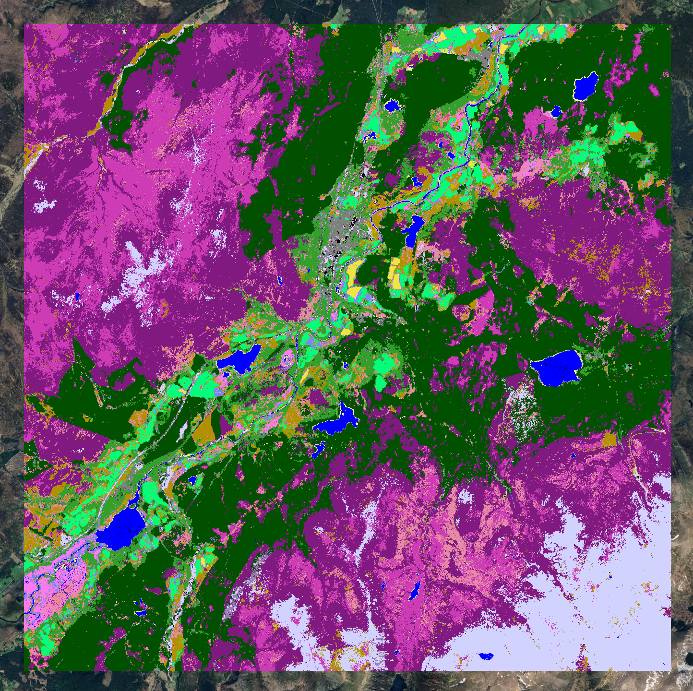
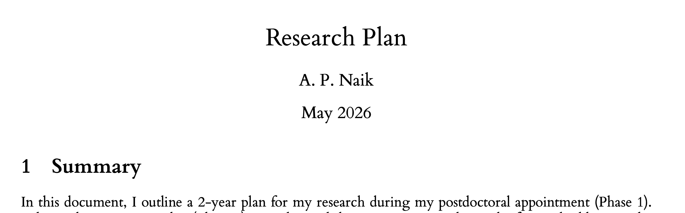
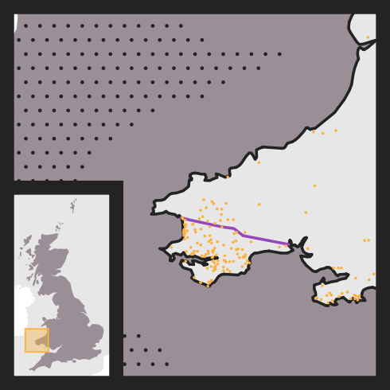
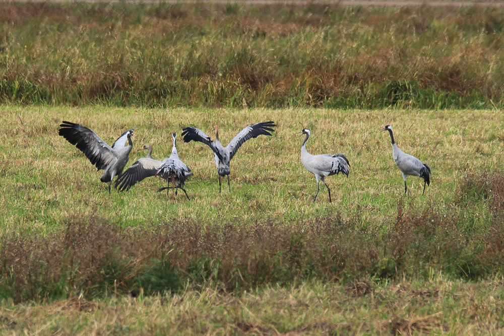
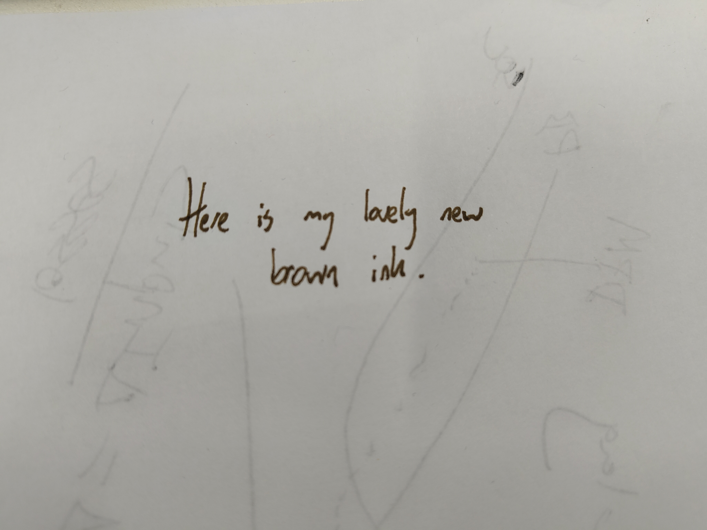

In the group I've joined at the University of Cambridge, there is something of a culture of writing "weeknotes" at the end of each week. The idea being to keep everyone up to date with what one is up to, but also to encourage one to be a little reflective and create some soft accountability. I'm also using it as an excuse to resurrect a blog that has long been in abeyance.

## What I was working on

### TESSERA

[TESSERA](https://geotessera.org/) is a geospatial foundation model developed here in Cambridge. It providing a vast, rich dataset of "embeddings": summary vectors for every 10m pixel on the planet. My new job is to do a bunch of conservation science with these embeddings.

This past week, I had my first proper play with the embeddings. I used them to train a very basic ML model, making some toy habitat maps of the [Centre for Landscape Regeneration](https://www.clr.conservation.cam.ac.uk/) project areas (the Cairngorms, the Fens, and Cumbria). These were just quick and dirty first passes to get a 'feel' for Tessera.

{fig-align="center" fig-alt="A habitat map of the Cairngorms" width="300px"}

### Research plan

I spent a lot of the week thinking about my longer term research goals, both for the coming years in Cambridge and the years thereafter. I've written up a first draft of a research plan, just 3 pages. I won't go into too much detail about it here, but it has been fun reading around a lot of the literature (see below!). One detail I will add here is that I used the typeface [Bembo](https://en.wikipedia.org/wiki/Bembo), which I've gotten very into recently.

{fig-align="center" fig-alt="A research plan written in Bembo" width="600px"}

### 100 Maps

I used the Bank Holiday Monday to get a bit of work done on my side project ("100 Maps of Britain", hoping to have a page about that on this site soon!). One of the maps is of linguistic roots of British place names. Here, I learned about the [Landsker line](https://en.wikipedia.org/wiki/Landsker_Line), a surprisingly sharp linguistic boundary in south Pembrokeshire between regions of predominantly English names (south) and Welsh place names (north). The line is thought to have been formed in the 12th century, when the Normans established themselves in the area and encouraged English settlement.

{fig-align="center" fig-alt="Predominantly English place names south of the Landsker line" width="300px"}

## What I was reading

### Research Literature

I read a bunch of stuff around: agri-environment schemes, causal inference, and some of the older back-catalogue of papers around the "land sharing" versus "land sparing" debate.[^1]

[^1]: Including many papers from [Andrew Balmford's group](https://www.zoo.cam.ac.uk/research/conservation-science/conservation-science) here at the Conservation Research Institute in Cambridge.

The idea here is that there are two broad approaches one could take to grow a fixed amount of food across a landscape: modern, intensive agriculture at a few sites and pristine nature reserves elsewhere (land sparing), or low-intensity, nature-friendly agriculture everywhere (land sharing).

Of course, the reality is not so much a binary as a spectrum. Nonetheless, evidence is beginning to accumulate in favour of approaches towards the land-sparing end of the spectrum. 

This is a nuanced question, and I won't be able to do it justice yet. Planning to read more about it in coming weeks.

### Elsewhere

Less work-related, I've been reading "What the Railways Did For Us" by Stuart Hylton. A very well-researched and funny book about the coming of the railways to Britain and their impact on society, such as the impact on the economy, on cities, and even on the class system. 

The opening chapter, concerning everyone's grumbles about the initial spread of railways, was particularly memorable. Here is Wilhelm I, Kaiser of Prussia, on the subject:

> No one will pay good money to get from Berlin to Potsdam in one hour when he can ride his horse there in one day for free.[^2]

[^2]: Wilhelm I (1864) quoted in 'What the Railways Did For Us', Stuart Hylton, (p15).

Parts of the discussion struck a painfully familiar note:

> Partly as a result of all this process, Britain became the most expensive country in the world in which to get consent for a railway. Sometimes the parliamentary process alone could cost thousands of pounds a mile, added to which some landowners might extract quite exorbitant payments for their land as the price for removing their objections.[^3]

[^3]: Discussion regarding difficulties in establishing railways in mid-19th century Britain. Idem, (p19). I can't quite get over the gutting of HS2. Perhaps I'm reading this book a little too soon.

## Miscellanea

Over the long weekend I saw a *lot* of birds at WWT Welney, including my first ever crane!

{fig-align="center" fig-alt="Photograph of cranes at WWT Welney" width="500px"}

I'm using a new ink: "Lie de Thé" by J. Herbin. As implied by the name, it's a beautiful deep-brown colour, I like it a lot.

{fig-align="center" fig-alt="Sample of my new ink" width="500px"}
