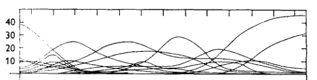
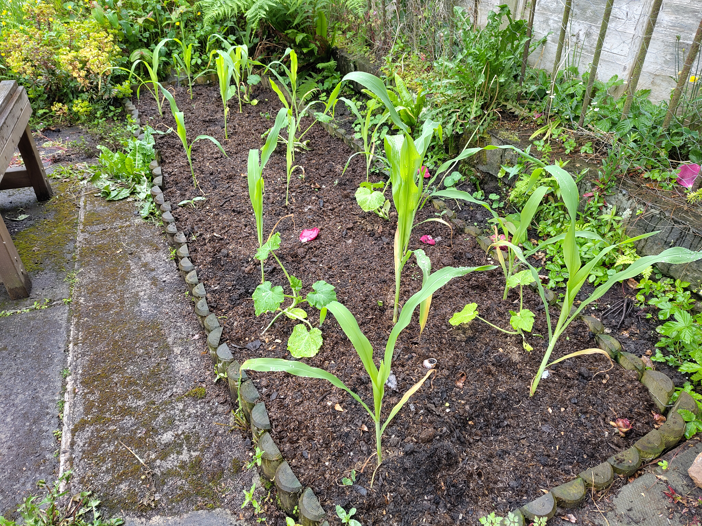

I've been up in Edinburgh this week after a fun couple of weeks down in Cambridge.

## What I was working on

### Research

I made incremental progress on various projects. Don't want to plant too many flags here yet until these are a *little* more mature. However, a couple of exciting bits:

**KBAs.** I'm going to be working with [BirdLife International](https://www.birdlife.org/) on finding new candidates for [Key Biodiversity Areas (KBAs)](https://www.keybiodiversityareas.org/). These are areas around the world flagged as key for conservation. 

The criteria for identifying KBAs are a little complicated, and the existing method for longlisting KBAs involves many repeated iterations of manual validation (and is therefore quite expensive). We're hoping to find a clever way, likely with TESSERA (see below), to automate a little bit of the longlisting.

This past week, BirdLife shared some of their data with me and I've started getting my teeth into it.

**TESSERA v1.1.** I wrote about [TESSERA](https://geotessera.org/) in last week's notes. This past week, a new version (1.1) has been released.[^1] This addresses some issues with v1.0, such as tiling artefacts. It also goes a little farther out from the coast everywhere. I've spent a bit of time playing around with the new embeddings, [which are very pretty](https://tze.geotessera.org/?store=v1.1)!

[^1]: My very small contribution to v1.1 was my involvement in the discussion of landmask choice. In arguing for a more generous coastal buffer, my ulterior motive was that I would really like to make a nice goose map.

### Python package: `datahues`

Yesterday I tidied up and released a python package I made some months back. It's called [`datahues`](https://github.com/aneeshnaik/datahues), and has a very simple functionality: given two colours, generate a perceptually uniform colour ramp between them. I find myself needing[^2] to do this all the time and in the past have always just bodged around with some quite complicated colour-space libraries, so I thought I would write a simple utility for it. It's now available on PyPI and conda-forge.

[^2]: "Needing" is perhaps too strong a word here.

Here is the figure from the README, demonstrating the need for the utility:

{fig-align="center" fig-alt="Two colour ramps: one perceptually uniform, the other not." width="600px"}

In the left-hand panel, the green transitions very unevenly to red: there is some awful banding in the transition zone. Without perceptual uniformity (as in the right-hand panel), one might well see patterns in data that aren't truly there.

Here is a map I made with `datahues` a few months ago, depicting the annual number of sunshine hours across GB:

](../assets/blogpost_images/20260605_sunshine.png){fig-align="center" fig-alt="A map of annual sunshine hours across GB." width="60%"}

It is very gloomy in the Highlands!

## What I was reading

Having written a first draft of my research plan [last week](20260529_weeknotes_2026_22.qmd), I spent a lot of time this week reading around the various topics that I plan to work on. Both contemporary methodological papers and some of older "classics" and foundational works.

One work in particular I thought I would write about is "Gradient Analysis of Vegetation" by R. H. Whittaker (1967).[^3] This was quite an important review work in vegetation ecology. Whittaker was interested in vegetation communities and how they are spatially distributed. The central idea he argued for is the "individualistic" concept, in which each species has its own unique response to environmental gradients. Observed communities then are just incidental assemblages of species at a given point along the gradient.

[^3]: [Whittaker, R.H. (1967). *Gradient Analysis of Vegetation*. Biological Reviews.](https://onlinelibrary.wiley.com/doi/10.1111/j.1469-185X.1967.tb01419.x)

{fig-align="center" fig-alt="A figure from Whittaker 1967, showing various tree species' distributions as a function of environmental moisture level." width="65%"}

Above, I'm reproducing a figure from the paper, showing distributions of major tree species in the Smoky Mountains. Each curve is the distribution of a single species as a function of environmental moisture level, from mesic (wet) to xeric (dry) with increasing x. The point being made here is that no two species have the same curve: each species shows an individualistic response to the environmental gradient. According to Whittaker, if you stand in a certain place and observe N species, that is an incidental assemblage of N species for which that environment falls within the acceptable range. It will be slightly less acceptable to some of them than others.

These ideas didn't originate with Whittaker: they are known as the "Gleasonian" paradigm, having originated in the earlier 1920s work of Harry Gleason. Whittaker's work arguing in favour of the Gleasonian paradigm was rather controversial. It stood against the prevailing "Clementsian" paradigm, which understood communities as discrete, bounded units, with relatively sharp boundaries ("ecotones") between them.

## Miscellanea

### Garden

Our vegetable seedlings had a bit of an adventure in May. They travelled 800 miles and lived in four different houses. Now, they're finally in the ground in our garden in Edinburgh.

{fig-align="center" fig-alt="A photograph of some seedlings in vegetable patch." width="65%"}

These are sweetcorn and yellow courgettes. We're growing them in the same bed (along with some upcoming borlotti beans), following the "three sisters" method of companion planting. The idea is that the corn provides a rigid structure for the beans to climb, while the beans fix nitrogen in the soil. The courgettes, meanwhile, provide ground cover to retain moisture and suppress weeds. 

All of our seeds were F1 varieties, a decision I now regret a little. Having recently read Dan Saladino's excellent book [*Eating to Extinction*](https://www.dansaladino.com/about-the-book), I'm a zealous convert to the idea of preserving traditional, open-pollinated seed varieties. Doing so helps preserve food heritage, rare flavours, and genetic diversity. Next year![^4] 

[^4]: In particular, I'm planning to join the [Heritage Seed Library](https://www.gardenorganic.org.uk/what-we-do/hsl).

### Clerihews

I learned this week about a very silly poetic form: the [clerihew](https://en.wikipedia.org/wiki/Clerihew). 4 lines, AABB, whimsical and funny, with the rhymes often extremely contrived and the metre absolutely all over the place. They were invented around the start of the twentieth century by Edmund Clerihew Bentley, and they are typically biographical, with the subject of the poem being the first line. For example, from Bentley's 1905 [*Biography for Beginners*](https://www.gutenberg.org/ebooks/46691):[^5]

[^5]: Bentley, E. C. (1905). *Biography for Beginners*. Read Books.

> Sir Humphry Davy\
> Abominated gravy.\
> He lived in the odium\
> Of having discovered sodium.

Another example, also from Bentley's collection:

> The people of Spain think Cervantes\
> Equal to half-a-dozen Dantes:\
> An opinion resented most bitterly\
> By the people of Italy.

They aren't always biographical. My favourite is from the introduction of Bentley's collection, and is about the very nature of biography:

>The Art of Biography\
>Is different from Geography.\
>Geography is about Maps,\
>But Biography is about Chaps.