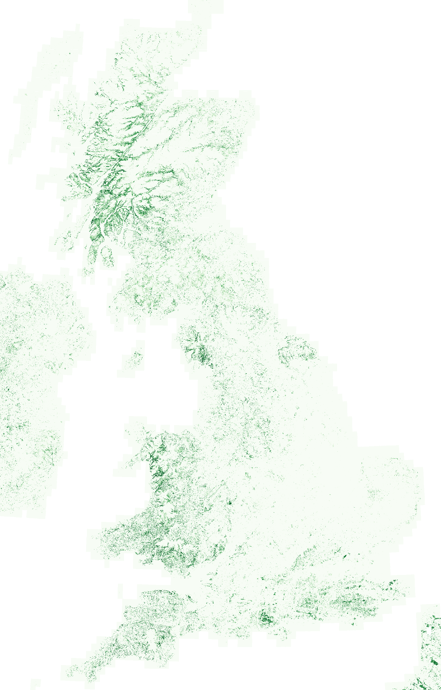

This note covers the last two weeks, from Monday 6th to present. I *might* settle into a fortnightly pattern rather than a weekly one.

## What I was working on


### Temperate Rainforests

Inspired by Guy Shrubsole's excellent book on the subject, I thought I would make a map of Britain's temperate rainforest by training a model with [TESSERA](https://geotessera.org/). 

::: {.aside}
[The Lost Rainforests of Britain](https://lostrainforestsofbritain.org/). That site is the home not just of the book, but of Shrubsole's wider campaigning around the issue of temperate rainforests and their conservation.
:::


Some context:

- Temperate rainforests are oak-dominated or hazel-dominated woodlands that are very rainy.
- They occur along the soggy western edge of Britain (hence: “Celtic rainforest”).
- They are very biodiverse, hosting internationally important assemblages of bryophytes/lichens/fungi etc.
- In Britain, they are rare/fragmented/degraded/overgrazed
- They are not well mapped. To my knowledge, the best map to date is the [crowd-sourced one](https://lostrainforestsofbritain.org/2022/12/13/public-create-map-of-britains-lost-rainforests/) produced by Guy Shrubsole. This was a fantastic project, but due to its crowd-sourced nature is certain to be incomplete.

::: {.aside}
I've hesitated to provide a precise definition of temperate rainforests here because there are multiple philosophies. One can define temperate rainforest climatically, with a rainfall minimum (1400mm/year) and various conditions on temperature variation, humidity etc. A more ecological definition is based on indicator species: the wonderful abundance of epiphytic mosses and liverworts and lichens. The latter definition is more appealling to me: a temperate rainforest *feels* more special than simply a forest that happens to be rainy: there is life upon life upon life. 
:::

Given that last point in particular, I wondered: can we map Britain's temperate rainforests from space?

In 1.5 days at the end of last week, I had an *extremely* quick and dirty first pass at this. Result below.

::: {.aside}
Method details: I used a PU (positive-unlabelled) learning algorithm with a LightGBM classifier. For my training data: points scraped from Shrubsole's rainforest map (P) and random points across GB class-balanced with the UKCEH landcover map (U).
:::

{fig-align="center" fig-alt="A TESSERA-generated map of temperate rainforest in Great Britain" width="65%"}

The map certainly seems to catch a great deal of rainforest down the western seaboard, but also tends to overpredict a little: it flags a lot of wet, woody places that aren't rainforest, such as birch-dominated boggy woodlands in the North York Moors, or alder-dominated boggy woodland in the New Forest. In ML terms, it seems by eye that the recall is good but the precision is bad. 

In the coming weeks, I'll have a go at improving this map. Primarily, I'll improve my training data and switch from a PU approach by getting some 'negative' examples. That said, we aren't sure yet whether there is a valuable 'science' case (read: publication) for the map, it might just be a fun story to engage the public. If so, still worth pursuing!

::: {.aside}
A colleague noted: "There is a spectrum from science to fluff, and this... is fluff."
:::

### Other Tidbits

**JASMIN.** I got set up with an account on NERC's [JASMIN HPC service](https://www.jasmin.ac.uk/). I've also been made the manager of the Cambridge Forest Ecology group on there, so have been getting to grips with the system. I'm writing up a "JASMIN for Forest Ecologists" user guide for my colleagues within my group, to prevent them paying too much of a startup cost to get going on JASMIN.

**Birds.** I had some great meetings these past weeks with people from eBird and BirdLife International about some upcoming projects mapping birds around the world using TESSERA. I spent a lot of time reading around the subject to prepare some research plans. Watch this space!


## What I was reading

As noted above, I spent a lot of time reading about species distribution mapping, particularly papers with an emphasis on *community* mapping. The main challenge here is understanding multi-species assemblages: what drives them, and how to map them.

I'll highlight one work in particular: [Spatial predictions at the community level](https://onlinelibrary.wiley.com/doi/abs/10.1111/brv.12222) by D'Amen et al. (2017), an excellent review published in Biological Reviews. Here, the authors describe three philosophies in community mapping:

::: {.aside}
[D'Amen, M., Rahbek, C., Zimmermann, N.E. and Guisan, A. (2017). *Spatial predictions at the community level: from current approaches to future frameworks*. Biological Reviews.](https://onlinelibrary.wiley.com/doi/abs/10.1111/brv.12222)
:::

1. **Assemble first, predict later.** Community-level traits/attributes are predicted as a function of environmental covariates.
2. **Predict first, assemble later.** Single species distributions are predicted as a function of environmental covariates. These are then 'stacked' to give community maps.
3. **Assemble and predict together.** Multiple-species distributions are predicted as a function of environmental covariates.

The authors point out that the first two philosophies map respectively on to the Clementsian and Gleasonian worldviews I wrote about [a few weeks back](20260605_weeknotes_2026_23.qmd). The third philosophy is most reflective of a more modern ecological worldview, somewhere between the two extremes: biotic interactions (ignored by Gleason's worldview) mean that different species *do* correlate or anti-correlate, but there aren't rigid, fixed "superorganism" communities as in the Clementsian worldview.

Although this has been the predominant ecological understanding for some time, computational barriers have meant that only recently has there been a significant move towards multi-species distribution mapping.


## Miscellanea

### Borders Abbeys Way

My wife and I have been walking the [Borders Abbeys Way](https://www.scotlandsgreattrails.com/trail/borders-abbeys-way/) in stages. Last week we walked the ~22km stretch from Jedburgh to Hawick. This was rather nice, some excellent views from Black Law, and then a lovely stretch along the Teviot up to Hawick. We saw yellowhammers, dippers, and a mating pair of yellow wagtails. This was our first stretch of the Borders Abbeys Way with no (visible) goosanders.

::: {.aside}
I learned three months ago that Hawick is pronounced HOYK.
:::

::: {.aside}
Goosanders have played something of a "London buses" role in my life: I went three-and-a-bit decades without knowingly seeing any, then I've seen maybe ninety in the past six months.
:::

Below is a map of the route. I've also uploaded it as a [route on the Ordnance Survey website/app](https://explore.osmaps.com/route/32339770).

```{python}
#| echo: false

import folium
import gpxpy

# 1. Open and parse the GPX file
with open("../assets/blogpost_gpxs/20260619_BAW.gpx", "r") as gpx_file:
    gpx = gpxpy.parse(gpx_file)

# 2. Extract latitude and longitude coordinates
coordinates = []
for track in gpx.tracks:
    for segment in track.segments:
        for point in segment.points:
            coordinates.append((point.latitude, point.longitude))

# 3. Initialize map centered at the start of your walk
start_point = coordinates[0]
my_map = folium.Map(tiles="OpenStreetMap")

# 4. Draw the walk route trail
folium.PolyLine(coordinates, color="#e74c3c", weight=5, opacity=0.8).add_to(my_map)

my_map.fit_bounds(coordinates)

# 5. Display the map
my_map
```
