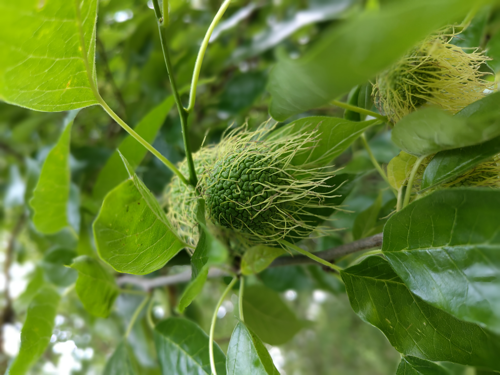
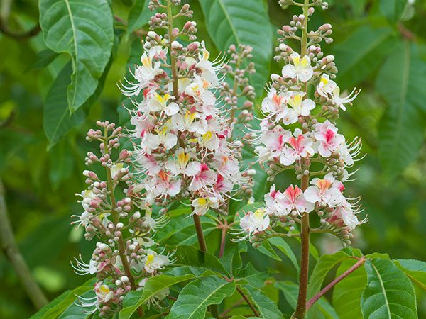
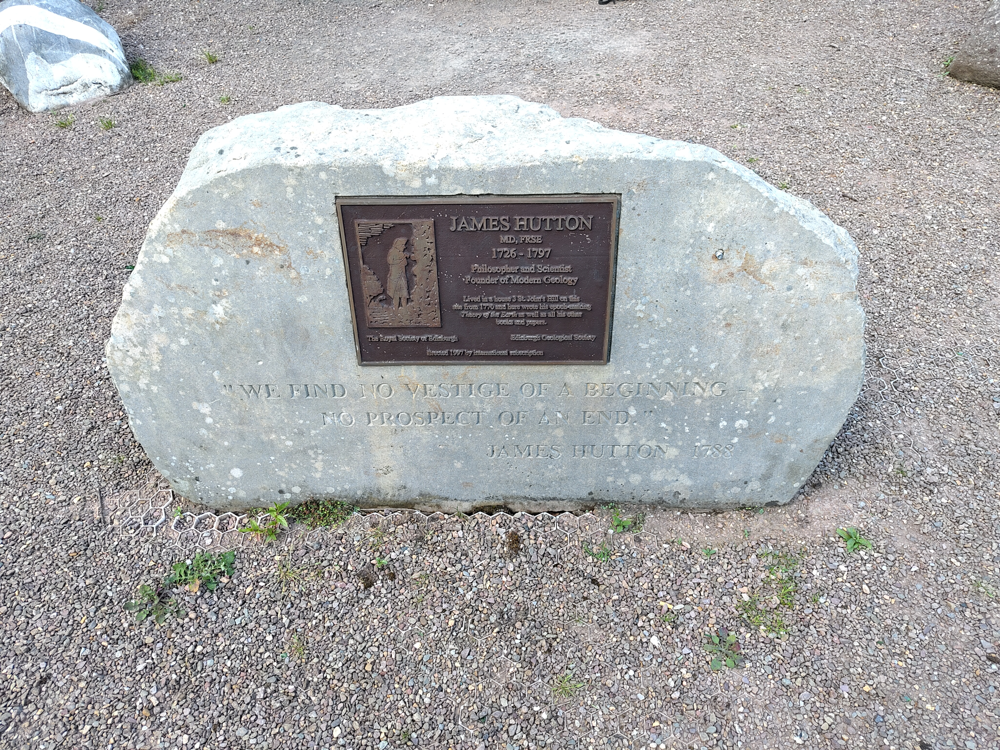

Since my last post, I have changed the domain name of the website from aneeshnaik.github.io to aneeshnaik.com. Any RSS subscriptions will likely break as a result!

## What I was working on

### Species Distribution Modelling: GeoLifeClef

This is the main thing I've been working on for the last ~1.5 weeks. The idea is to see how well [TESSERA](https://geotessera.org/) does at species distribution modelling ([SDM](https://en.wikipedia.org/wiki/Species_distribution_modelling)). SDM is a fun idea: given a set of species occurrence records and some environmental covariates / remotely sensed images, predict the distribution of the species across a landscape. For years I've been interested in SDM, because it combines basically all of my interests: nature, maps, grungy Bayesian statistics to deal with the extreme observational bias.[^1] I've dabbled a little in the past with small projects, but this is my first time really pursuing a project full time in a professional capacity. I'm excited to be working on this!

[^1]: The only thing missing is cryptic crosswords. Perhaps I could ask the Guardian for the IP addresses of online crossword solvers, then make a species distribution model of cruciverbalists.

My idea for a first project here was to apply Tessera to the [2024 GeoLifeClef competition](https://www.kaggle.com/competitions/geolifeclef-2024/overview). This is an annual SDM competition hosted on Kaggle, run by the Pl@ntNet team. The idea is to make multi-species SDMs using the GeoPlant data: ~10k plant species, ~90000 presence-absence points, and ~5 million presence-only points.[^2]

[^2]: Presence-only data are opportunistic samples, such as citizen science data, simply logging where a species was found. With presence-only data, absence of evidence is not evidence of absence. Presence-absence data are structured surveys confirming both where a species was found and *where it was not*.

**Experiment:** GeoLifeClef provides a “baseline” model using just Sentinel-2 images (128x128 10m pixels, R/G/B/NIR). It ignores the presence-only data in the GeoPlant dataset, and trains only on the presence-absence data. It’s a relatively simple model. Not to say light, it’s a relatively big neural net, but just plug+play, nothing fancy at all with hyperparameter tuning / ensemble learning etc (which the winning submissions all do). Basically I took that baseline and swapped in Tessera “images”. I’m using Tessera v1.0 because 1.1 is not yet available over the whole region (which spans basically all of Europe).

**Headline result:** Tessera beats the baseline model *by a wide margin*. It gives an even better result than the baseline model with S2 supplemented with landsat+bioclim time series.

**Detailed scores:**
These are the “private” F1 scores used to rank submissions for the GeoLifeClef competition.\
1. Baseline S2-only model: 0.23629 (would have ranked 38th in competition)\
2. Baseline S2 +Landsat time series + Bioclim time series model: 0.31626 (would have ranked 25th in competition)\
3. Tessera-only model (i.e., model 1 with S2 images replaced by Tessera images): 0.33032 (would have ranked 11th in competition)\

For reference, the top 3 scores were: 0.40890, 0.36837, 0.35292. But, as I mentioned above, these all do much more sophisticated things. Not necessarily heftier architectures, but a lot of hyperparameter tuning, ensemble stuff, and they incorporate the GeoPlant presence-only data, which the “baseline" models ignore.[^3]

[^3]: Perhaps surprisingly, it seems that adding the presence-only data was only marginally beneficial for these submissions, even though it’s a *huge* augmentation of the training data.

## What I was reading

In conjunction with my SDM work described above, I've been reading around a lot of the recent SDM literature. One thing in particular I wanted to learn about is how to effectively quantify uncertainty. One very recent work I read on the subject is [*Conformal prediction quantifies the uncertainty of species distribution models*](https://www.sciencedirect.com/science/chapter/bookseries/abs/pii/S0065250426000073) by Poisot (2026).[^4] It explores the idea of using the (presently very trendy!) technique of [conformal predictions](https://en.wikipedia.org/wiki/Conformal_prediction) to provide uncertainties[^5] on the predictions of SDMs. This seems like quite a promising avenue! It is a frequentist approach to uncertainty quantification, which to me is much less appealling than a fully Bayesian formalism would be. However, it is likely a much more robust approach in the regime where models are somewhat 'misspecified', as any SDM is likely to be. Much to chew on!

[^4]: [Poisot, T. (2026), *Conformal prediction quantifies the uncertainty of species distribution models*, Advances in Ecological Research](https://www.sciencedirect.com/science/chapter/bookseries/abs/pii/S0065250426000073)
[^5]: Or, more precisely: coverage guarantees.

On the subject of more Bayesian approaches to SDM: I read a couple of papers describing the usage of INLA (integrated nested Laplace approximation) for Bayesian inference in the context of SDM. For example, [Isaac et al., (2020)](https://www.sciencedirect.com/science/article/pii/S0169534719302551) wrote a lovely review article.[^6] The basic idea is to treat species observations as a point process. There is an underlying "true" species distribution, and observations are points sampled from the distribution. Presence-only and presence-absence data can be separately modelled from the same underlying distribution by writing down different observational likelihoods capturing the different observation processes. One can then infer the posterior (i.e., the "true" species distribution) by applying normal Bayesian inference techniques. In practice, techniques like Markov Chain Monte Carlo (MCMC) are likely too expensive for the extremely high-dimensional posterior, but if one makes some approximations then one can perform the inference relatively cheaply with INLA. [Morera-Pujol et al., (2023)](https://onlinelibrary.wiley.com/doi/abs/10.1111/ecog.06451) provide a great example of doing this in practice, mapping deer distributions in Ireland, combining presence-only and presence-absence data.[^7] 

[^6]: [Isaac, N. J. B. et al., (2020), *Data Integration for Large-Scale Models of Species Distributions*, Trends in Ecology & Evolution](https://www.sciencedirect.com/science/article/pii/S0169534719302551)
[^7]: [Morera-Pujol, V. et al. (2023), *Bayesian species distribution models integrate presence-only and presence–absence data to predict deer distribution and relative abundance*, Ecography.](https://onlinelibrary.wiley.com/doi/abs/10.1111/ecog.06451)

I *really* like this Bayesian approach to SDM. It exactly matches the idea I carry around in my head for how SDM (and basically all empirical science!) ought to work in principle. That being said, it is not without its problems. One issue is that one 'models away' the [spatial autocorrelation](https://en.wikipedia.org/wiki/Spatial_analysis#Spatial_auto-correlation) by adding a 'random spatial field' term to the model. The same group that wrote the review paper cited above have [separately shown](https://onlinelibrary.wiley.com/doi/abs/10.1111/ecog.06391) that the results you get from INLA are *extremely* sensitive to your choice of mesh size on this random spatial field.[^8]

[^8]: [Dambly, L. et al. (2023), *Integrated species distribution models fitted in INLA are sensitive to mesh parameterisation*, Ecography.](https://onlinelibrary.wiley.com/doi/abs/10.1111/ecog.06391)

## Miscellanea

### Trees of the Cambridge University Botanic Garden

I've visited the Cambridge University Botanic Garden many times. Last weekend was my first time really appreciating its *wonderful* collection of trees. My wife and I diligently followed the [Trees of the Botanic Garden Trail](https://www.botanic.cam.ac.uk/learning/trails/trees-trail/),[^9] which took us to 13 excellent trees around the garden. Two highlights:

1. The Osage orange (*Maclura pomifera*). This is a tree with very odd-looking fruit, described in the trail booklet as "pickled gardeners' brains".

{fig-align="center" fig-alt="Funky fruit on the Osage orange tree." width="55%"}

2. The Indian horse-chestnut (*Aesculus indica*). This is a glorious tree, and was in flower when we visited. Interestingly, the flowers all have either pink or yellow centres: yellow at first, then pink once they have been pollinated!

{fig-align="center" fig-alt="Pink and yellow flowers on the Indian horse-chestnut" width="65%"}

[^9]: There are is a booklet at the Garden's entrance, containing a map of the trail and a description of each tree and its significance.

### James Hutton Memorial Garden

Continuing the subject of visiting gardens and diligently following paper guides. My wife and I have been working through a book called "Secret Edinburgh: An Unusual Guide". This is a guidebook full of weird and hidden spots around the city. Earlier this week it took us to the James Hutton Memorial Garden, not far from Holyrood. Despite its central location, it was extremely difficult to find. One reaches it by going into the car park of the University gym (the Pleasance Complex), then looking for the entrance to a path in between parking bays 20 and 21. This path then snakes down a steep hill to the garden.

{fig-align="center" fig-alt="Photograph of James Hutton memorial garden" width="55%"}

The garden was built on the site where once stood the house of James Hutton, the 18^th^ century Scottish "Father of Modern Geology".[^10] An interesting feature here is the collection of rocks placed around the garden. One interesting rock, just visible at the top-left of my photo above, was taken from Glen Tilt in the Cairngorms. This was the site where James Hutton observed veins of granite running through schist and limestone (as in the photographed rock). From this, he developed the theory of *plutonism*, that igneous rocks formed from volcanic activity, and not from crystallisation in the oceans.

[^10]: I've learned a lot about James Hutton since moving to Scotland. I've often experienced a kind of déjà vu when coming across a rock formation with a nearby plaque describing it as "Hutton's Unconformity": *the* site where James Hutton noted rock layers at different angles and thus came up with his ideas of uniformitarianism. He seems to have undergone this revelation 10 or 12 times.

