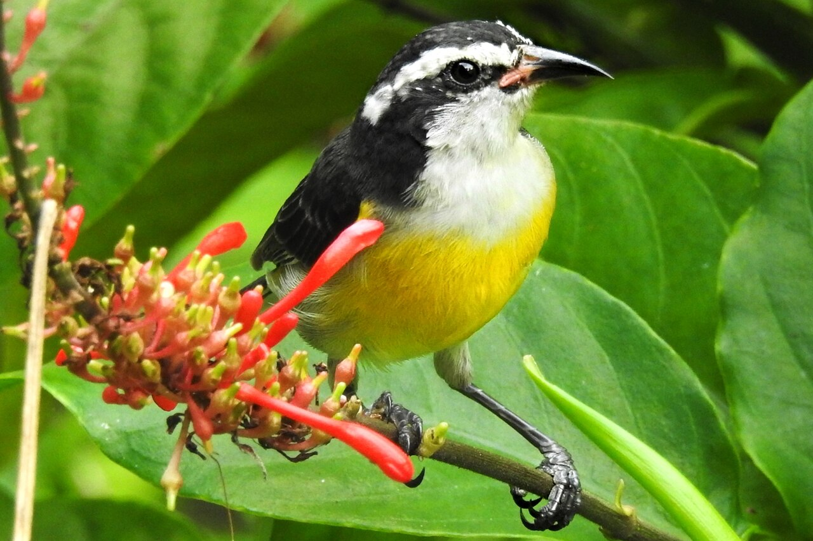
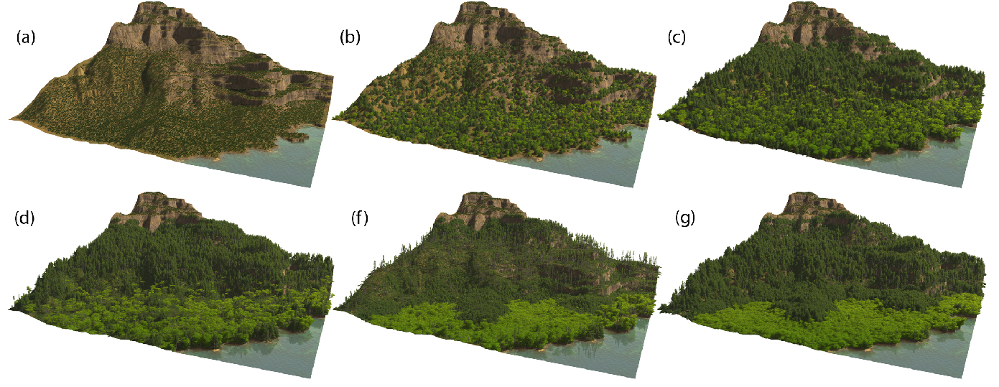
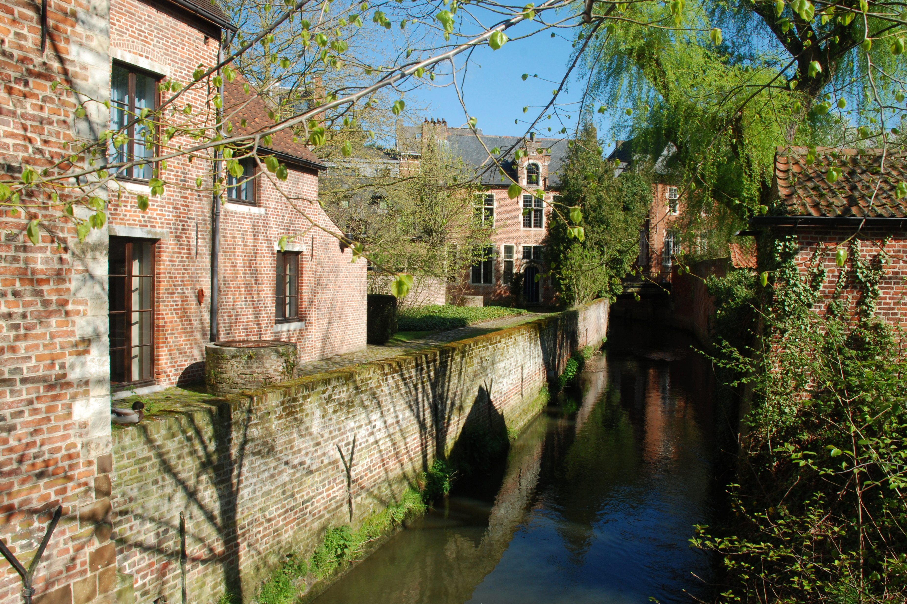

## What I was working on

### Species Distribution Modelling: GeoLifeClef

As I mentioned in my [previous weeknote](20260703_weeknotes_2026_27.qmd), I've been working on [species distribution modelling (SDM)](https://en.wikipedia.org/wiki/Species_distribution_modelling) using [Tessera](https://geotessera.org/) embeddings as covariates. In particular, I've been playing around with the [GeoLifeClef challenge](https://www.kaggle.com/competitions/geolifeclef-2024/overview), an annual SDM competition using the GeoPlant benchmark dataset.

This has been the main thing I've been working on these past couple of weeks. In particular, I've been doing a lot of experiments with different models / ML architectures, both with Tessera and with the provided data (Sentinel 2 + Landsat + Bioclim).

The main result so far: **Tessera plus a relatively simple model gets a pretty high score, equivalent to roughly 2nd place in the 2024 competition.**[^1]

[^1]: Last time I wrote, I was at 11th place. Remarkably, the improved result is actually with a more light-weight model (i.e., one with fewer trainable parameters). The main cause of the boost is using an ensemble of models, using a spatial block strategy to feed different subsets of the data to each ensemble member.

It's worth noting that even this high-scoring model only uses the presence-absence data in the GeoPlant dataset. The winning efforts in the competition all incorporated the additional presence-only data.[^2] I'm not sure if I will attempt to incorporate the additional data or not: I think the results I have so far are already sufficent to demonstrate a nice point: geospatial foundation models are good at species distribution modelling!

[^2]: See my [previous weeknote](20260703_weeknotes_2026_27.qmd) for a discussion of presence-absence versus presence-only data.

### Bird Assemblages

This past fortnight I've started working with some colleagues downstairs at BirdLife International, plus some other colleagues from farther afield, on a project using opportunistic bird observations (e.g., from eBird) alongside Tessera to build habitat maps. The idea is that *assemblages* of birds are highly indicative of ecosystem type. 

I haven't done any "science" yet. So far, I've just read a few papers and played around with some data my colleagues shared with me, including a table of associations between bird assemblages and habitat types. Playing around with this table, I've learned about a few new birds and habitats, such as the [bananaquit](https://en.wikipedia.org/wiki/Bananaquit) and the [renosterveld](https://en.wikipedia.org/wiki/Renosterveld).

{fig-align="center" fig-alt="Photo of a bananaquit." width="65%"}

## What I was reading

### Synthetic Silviculture

A few weeks back, I met [Dominik Michels](https://www.informatik.tu-darmstadt.de/iams/home_iams/index.en.jsp) from TU Darmstadt. He told me about some of the work his group is doing on forest simulations. This past week, I finally got round to reading some of their papers. For example: [Synthetic Silviculture](https://dl.acm.org/doi/10.1145/3306346.3323039).[^3] 

[^3]: [Makowski, M et al., *Synthetic silviculture: multi-scale modeling of plant ecosystems*, ACM Trans. Graph (2019).](https://dl.acm.org/doi/10.1145/3306346.3323039)

The basic idea is that a *real* tree is represented by a *topological* tree: nodes and edges. It has various parameters that set its growth and branching rate. Neighbouring trees shade each other following ray physics calculations. Other processes (reproduction, fire, etc.) are also implemented.

Videos of the simulations seem really impressive. We talked a little about how we might use remote sensing to provide validation experiments for the simulations, and we also talked about conservation research questions one might address with such simulations, like simulating the effects of deer control in the Cairngorms.

{fig-align="center" fig-alt="Figure from synthetic silviculture simulation." width="95%"}

### 15 Reasons for Conservation Monitoring

A few weeks ago, we had [Prof. Hugh Possingham](https://en.wikipedia.org/wiki/Hugh_Possingham) visit us to give a colloquium. His talk was, by design, rather provocative. In particular, he seemed to be advocating a philosophy where one should only pursue a nature monitoring project when one envisages a specific on-the-ground action that will result from the monitoring. 

I found myself worrying quite a lot about this philosophy. While it seems pragmatic in principle, I fretted about all the data that would never have been collected had scientists always strictly followed this philosophy. For example, a great deal of knowledge we have today about effective conservation practice comes from conservationists continuing their monitoring schemes well into the post-intervention phase, even when they knew the outcomes of their interventions, when they had no further planned actions in mind, and when they might well have devoted their resources elsewhere.

This past week I went away and read [his paper on the subject](https://doi.org/10.1098/rspb.2025.2527).[^4] The paper is actually much more circumspect than the talk. It lists 15 reasons for a conservation monitoring programme, framing them as a checklist that one can go through when planning a project. Included among the reasons are some of the more 'nebulous' reasons for data-gathering, like 'basic research', 'taking the pulse of nature', and 'societal curiosity'. These are all framed as valid reasons to pursue research. The main point of the article is to encourage scientists to think a little more explicitly about their reasons to pursue different projects. Then, by having thought more explicitly, they can might be able to allocate their finite resources in the best way.[^5]

[^4]: [Helmstedt, K. J. et al., *How monitoring matters for nature conservation: 15 reasons framed in a theory of change*, Proc. R. Soc. B (2025)](https://doi.org/10.1098/rspb.2025.2527)
[^5]: The paper also encourages the reader to couch their all of the different reasons into a ['theory of change'](https://en.wikipedia.org/wiki/Theory_of_change), to help understand how the different reasons relate to downstream impacts/outcomes. 

I certainly feel I could do with taking this message on board! I'm not sure whether any of my current research can be classed as 'conservation monitoring'. However, I might nonetheless consult this checklist next time I am planning a project, in order to be a little more clear and intentional about the expected impact of my research.

## Miscellanea

### Leuven

Last weekend I visited Leuven, in Flanders. This was my first time visiting Leuven, and I thought it was delightful. It reminded me a little of Cambridge: a beautiful university town with narrow streets, many bicycles, and a winding river lined with willows and ancient buildings.

{fig-align="center" fig-alt="Part of the Great Beguinage, Leuven." width="75%"}

A highlight of the city is the UNESCO-listed "Great Beguinage".[^6] The article I read beforehand recommended seeing some of the other beguinages of Flanders so that I could really appreciate the greatness of the Great Beguinage. It didn't, however, explain what a beguinage was, so I went in blind.

[^6]: In Dutch/Flemish: the Groot Begijnhof.

As it turns out, a beguinage is a built community created by *beguines*: religious women who lived a communal life, without taking the strict vows of the convent. There are a number of these beguinages around the Low Countries, Flanders in particular. The Great Beguinage in Leuven is particularly charming. It was founded in the 13th century but with most present buildings from the 17th century. It has lovely cobbled streets and courtyards and red brick buildings deviating quite far from rectilinear. The whole site was purchased by the university, KU Leuven, in the 1960s. 

### LinkedIn

I finally caved in and set up a [LinkedIn profile](https://linkedin.com/in/aneesh-naik-2030191a5). I was quite nervous about this as I've never much liked social media. Let's see.

