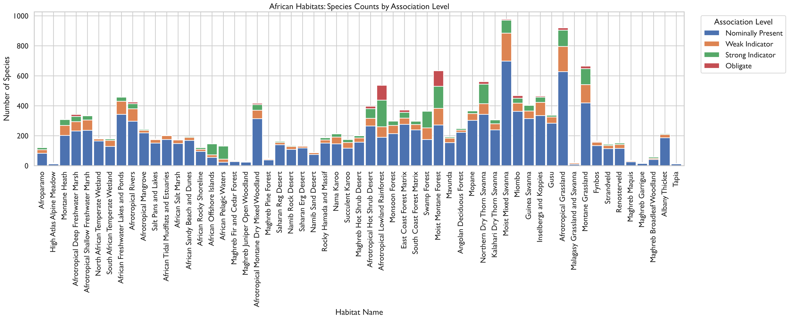
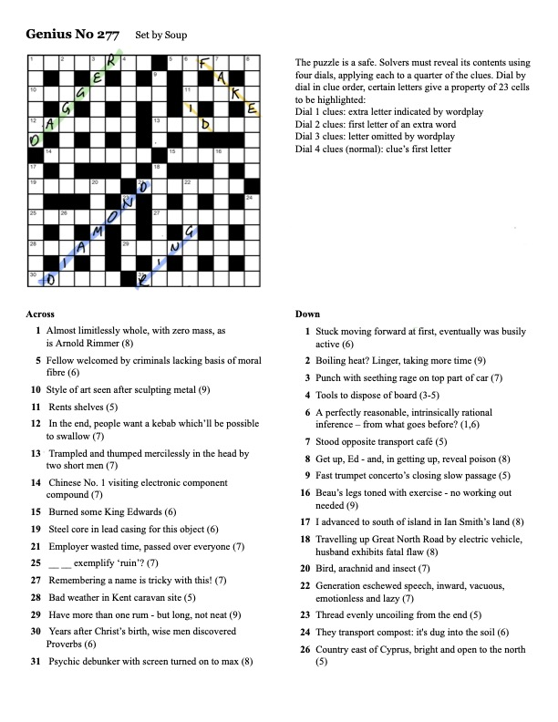
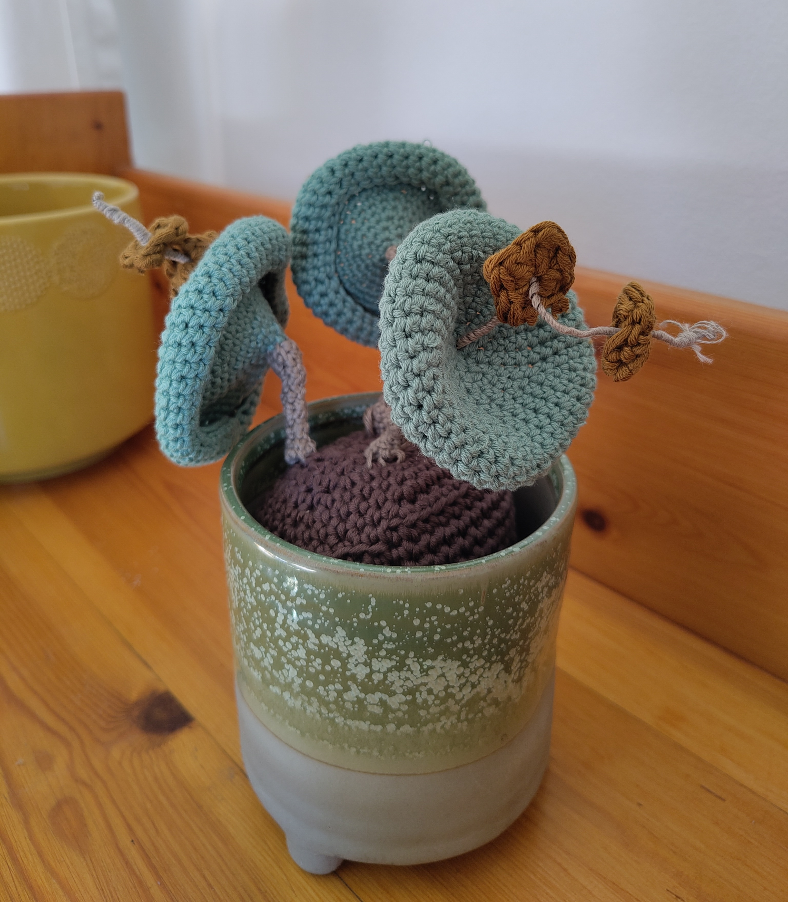

Thus far, I've worked very hard to prevent this blog from devolving into Yet Another Cryptic Crossword Blog. Today, these efforts fail.

## What I was working on

### Species Distribution Modelling

As in previous weeks, I've spent a good amount of time playing around with species distribution modelling with [TESSERA](https://geotessera.org/).[^1] In particular, I've been using the GeoPlant dataset used for the annual [GeoLifeClef competition](https://www.kaggle.com/competitions/geolifeclef-2024/overview). Over the last month or so I've made a big mess with a myriad of scattered experiments. I'm now attempting to bring everything together with a final "grid" of models that encapsulate my various conclusions. I'll run this grid over the coming period.  

[^1]: See also my weeknotes [26+27](20260703_weeknotes_2026_27.qmd) and [28+29](20260720_weeknotes_2026_29.qmd) for discussion of this project.

As a first taster, here is a bar chart showing the performance of my "fiducial" model[^2] with three input data modalities: Sentinel-2 images, [AlphaEarth](https://deepmind.google/blog/alphaearth-foundations-helps-map-our-planet-in-unprecedented-detail/) embedding "images", and TESSERA embedding "images". All images are 128x128 10m pixels. Performance is measured by the sample-weighted F1 score used in the GeoLifeClef competition.

[^2]: The fiducial model is a ResNet-18 CNN. Before hitting the CNN, the data passes through a small two-layer adapter block (convolution + ReLU) that maps the input data to 32 channels. The idea here was to make the comparison across modalities as fair as possible: only the input data and  preprocessing differ while the core architecture is held constant. Post-backbone, there is then a lightweight two-layer classification head. At prediction time, each model is ensembled across 8 spatial folds.

{fig-align="center" fig-alt="Bar chart showing GeoLifeClef scores for three models." width="80%"}

The two geospatial foundation models, AlphaEarth and TESSERA, beat the "traditional" remote sensing modality (Sentinel-2) by a convincing margin. Of the two, TESSERA just about inches ahead of AlphaEarth.[^3]

[^3]: To give some context for these scores, AlphaEarth and TESSERA are roughly comparable with the second/third/fourth place entries in the 2024 GeoLifeClef competition. However, as I've noted before, these entries supplement the 80,000 survey plots which I am using with an additional 5 million opportunistic plant records. 

### Bird Assemblage Mapping

These past few weeks I've spent one day per week working on bird-derived habitat mapping project I described in [my previous weeknote]([28+29](20260720_weeknotes_2026_29.qmd)).[^4] I haven't gotten as far as making a map yet, as I've been spending quite a bit of time understanding and preparing the data that have been shared with me by my collaborators.

[^4]: It's worth noting also that this project is conceptually quite similar to the project I'm working on with Michael Dales and Alison Eyres, described on Michael's blog [here](https://digitalflapjack.com/weeknotes/2026-07-20/) and [here](https://digitalflapjack.com/weeknotes/2026-07-27/).

The main dataset is a table of associations between bird species and the habitat types under the [Habitats of the World](https://press.princeton.edu/series/habitats-of-the-world?srsltid=AfmBOopA0eX5yfi3EDSaHSuiNeEX-oPrrmJlt3xoYo2kKNfx2ws8R7jP) typology. To give a sense of what this looks like, the bar chart below shows the number of species in each of the 57 African habitats, disaggregated by association strength.[^5]

[^5]: The association strengths shown in the diagram are:\
- Obligate: species found only in a given habitat / very rarely in another.\
- Strong Indicator: species usually found in a given habitat but not restricted to it.\
- Weak Indicator: species seen in less than a third of habitats on a continent, generally all within the same biome.\
- Nominally Present: species found in given habitat but also in many other habitats, of multiple biomes.\

{fig-align="center" fig-alt="Bar chart showing birds associated with African habitats, disaggregated by association strength." width="100%"}

In addition to this table, I was also given a wealth of birding checklists from various sites in South Africa and Australia. Here, a somewhat irksome problem creeps in: species identifiers. Many of the birdlists use a different name for a given species compared with the bird-habitat table.[^6] On Friday, over the course of several rather strong cups of coffee, I manually built a table of corrections.[^7] This was non-trivial: often, the name differences are not simply synonyms but taxon merges/splits. In the case of a split, I had to use geographic information to work out which of the derived species more likely corresponded to the observation. As part of my sanitisation, I moved to using the eBird "species code" as a more stable unique identifier for each species.

[^6]: The latter uses the [2024 Clements checklist](https://www.birds.cornell.edu/clementschecklist/introduction/updateindex/october-2024/).
[^7]: I used [avibase](https://avibase.bsc-eoc.org/avibase.jsp?lang=EN) to look up synonyms. In principle one could imagine automating this process, but there were so many quirks and exceptions that any kind of robust process would take even longer to develop than my manual procedure took to complete.

Painful, but actually quite fun! Plus I got to look at a lot of nice birds as I went along. For example, the Papuan pitta (*Erythropitta macklotii*... or is it *Pitta erythrogaster*??).

{fig-align="center" fig-alt="Photograph of a Papuan pitta." width="60%"}

## Meetings

I had quite a few interesting meetings this past fortnight:

- Meeting with [Paul Elsen from the Wildlife Conservation Society](https://www.wcs.org/our-work/solutions/conservation-planning/paul-elsen) to discuss using TESSERA / geospatial goundation models in their [Nature Health Index](https://www.nceas.ucsb.edu/workinggroups/nature-health-index-holistic-approach-measuring-and-mapping-ecological-integrity).
- Mini-workshop in the David Attenborough Building with all the various people doing habitat mapping with TESSERA. Organised by [David Coomes](https://www.plantsci.cam.ac.uk/people/david-coomes).
- Meeting with [Michael Dales](https://digitalflapjack.com/) and [Alison Eyres](https://www.zoo.cam.ac.uk/people/alison-eyres) to discuss our global habitat mapping work (see margin note 4 above).
- Meeting with [S. Keshav](https://svr-sk818-web.cl.cam.ac.uk/keshav/), [Silja Sormunen](https://www.cst.cam.ac.uk/people/sas268), and [David Coomes](https://www.plantsci.cam.ac.uk/people/david-coomes) to discuss a potential new project building a global landcover hierarchy.
- Meeting with [Jacob Drucker](https://www.plantsci.cam.ac.uk/people/jacob-drucker) to discuss occupancy modelling of bird species.
- Telecon with [E-Ping Rau](https://www.gu.se/en/about/find-staff/e-pingrau) to discuss tree species distribution modelling with TESSERA.

## Miscellanea

### Crossword

Over a few sessions in July, I worked on a delightful crossword with my wife and some friends: the [Guardian "Genius" crossword, number 277](https://www.theguardian.com/crosswords/2026/jul/06/genius-crossword-no-277).

The Genius is a monthly crossword associated with a cash prize.[^8] The clues themselves are actually not *too* hard, but each puzzle does have an unusual twist which makes the overall puzzle quite a challenge. In #277, the rubric itself was hilariously cryptic:

[^8]: The deadline was yesterday, Saturday 1st August. So, I'm allowed to post my solution here. See also the writeup on [fifteensquared](https://fifteensquared.net/2026/08/02/guardian-genius-no-277-by-soup/).

> The puzzle is a safe. Solvers must reveal its contents using four dials, applying cach to a quarter of the clues. Dial by dial in clue order, certain letters give a property of 23 cells to be highlighted:\
>Dial 1 clues: extra letter indicated by wordplay\
>Dial 2 clues: first letter of an extra word\
>Dial 3 clues: letter omitted by wordplay\
>Dial 4 clues (normal): clue's first letter\

I had to read this ten or twelve times before I understood it (/ gave up trying to understand it). The essence of it is that each clue in the crossword yields an additional letter, falling into one of four categories. Concatenate them in the right order to receive further instructions. Below is an image of the completed crossword, with colours indicating the four categories.

{fig-align="center" fig-alt="Image of Guardian Genius Crossword with answers filled in." width="60%"}

The additional letters, spelt out dial by dial, then say: CONTAINSAMELETTERASTODAYSCRYPTIC. Or, "contain same letter as today's cryptic". "Today's cryptic" refers to the "normal" [Guardian cryptic #30051](https://www.theguardian.com/crosswords/cryptic/30051), which was released on the same day as Genius #277. If one highlights just the cells in which both crosswords contain the same letter, one sees the hidden objects emerge:

{fig-align="center" fig-alt="Bar chart showing GeoLifeClef scores for three models." width="60%"}

Dagger, fake ID, diamond ring. These are the final answers which are submitted for the prize. I confess I can't see a connection between the three (other than that they might go in a safe?), but I suspect there's a cultural reference I'm missing.

In addition to a weird and wonderful puzzle concept, the crossword also had a new (to me) type of clue. 25 across:

> ____ ____ exemplify ruin? (7)

The answer is DESTROY (="ruin"). The blank parts of the clue are "Does Troy" (there's an extraneous letter O here, according to dial 1). So, the clue's wordplay *includes* the literal answer!

### Crochet

Last week was my wife's and my "cotton" anniversary, and we exchanged gifts of cotton. For my part, I attempted my first ever three-dimensional crochet, a *Crassula umbellata*. Pattern from ["Stylish Succulents to Crochet"](https://www.searchpress.com/book/9781782219019/stylish-succulents-to-crochet) by Sarah Abbondio. Photo below.

{fig-align="center" fig-alt="A crocheted Crassula umbellata." width="70%"}

It was *much* harder than I thought it would be. I'm going to return to two dimensions for a while.