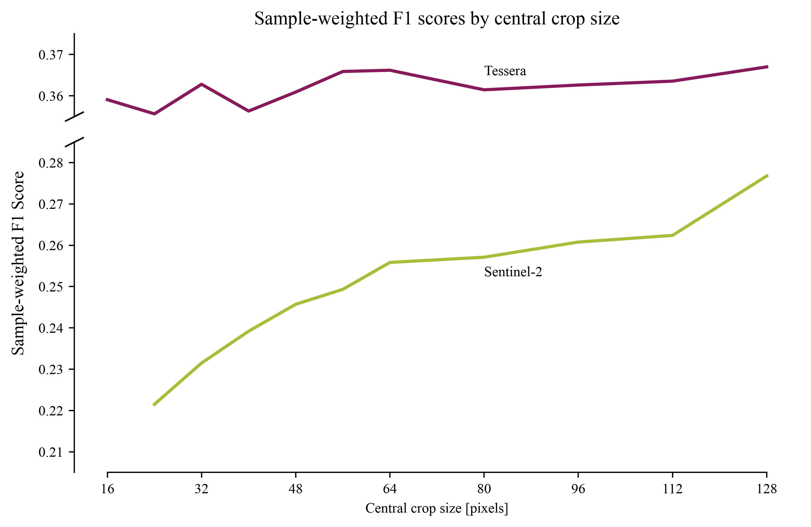
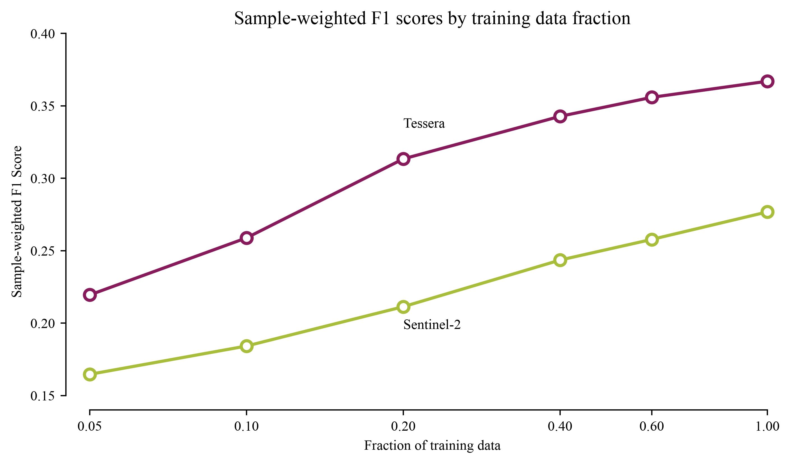
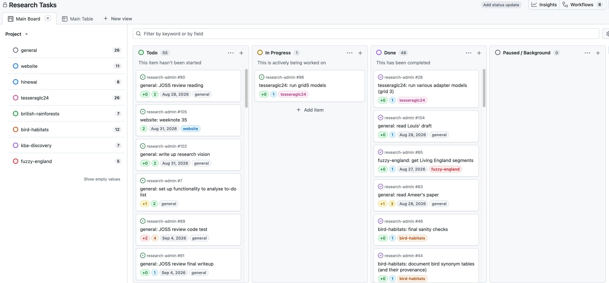
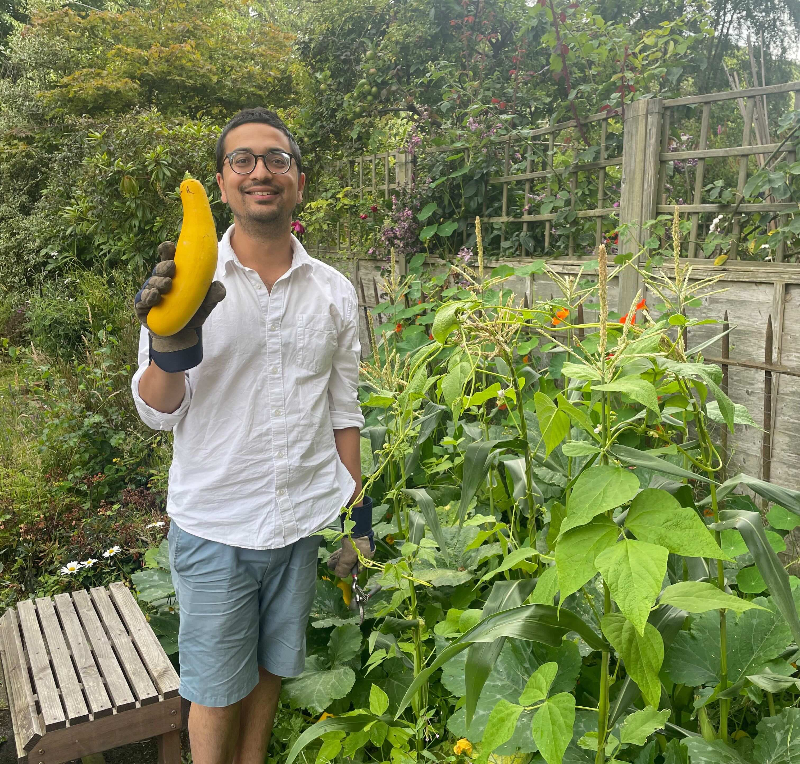

## What I was working on

### Species Distribution Modelling

As in previous weeks recently (e.g. [29](20260720_weeknotes_2026_29.qmd), [31](20260802_weeknotes_2026_31.qmd), [33](20260817_weeknotes_2026_33.qmd)), my main project these last couple of weeks has been my SDM benchmarking work.[^1] I promised in my last weeknote to run a few grids of models and show some resulting figures in this post. These are below.

[^1]: Recap: I'm essentially trying to find out how good [Tessera](https://geotessera.org/) is at species distribution modelling (SDM), the problem of mapping the spatial distribution of a species given some occurrence data. To do this, I'm using the [GeoPlant benchmark dataset](https://arxiv.org/abs/2408.13928), as used in various [GeoLifeClef](https://www.kaggle.com/competitions/geolifeclef-2024/overview) competitions.

#### Spatial Context

{fig-align="center" fig-alt="Graph showing GeoLifeClef scores under varying spatial context." width="80%"}

This figure shows how SDM performance varies as a function of spatial context fed to the model. The graph plots sample-weighted F1 scores (as plotted in previous weeknotes) as a function of "central crop size": the pixel size of the input image fed to the model (ranging from a 16x16 square to a 128x128 square). It appears here that the S2-trained model benefits greatly from additional spatial context, while the Tessera-trained[^2] model only sees a modest improvement. My interpretation of this is that the Tessera-trained model has plenty of species-discriminating information content in the temporal behaviour / phenology of the central pixels, and doesn't really need the information contained in the surrounding pixels to learn any more. The S2-trained model, on the other hand, does not have nearly as much information about the central pixels and so takes what it can get in the environs.

[^2]: The eagle-eyed reader might notice I've switched from upper-case "TESSERA" to title-case "Tessera". This follows a very emphatic and well-reasoned plea for a universal rebrand by Tessera's comms officer: [Constantino Panagopulos](https://www.linkedin.com/in/constantino-panagopulos/).

#### Label Efficiency

{fig-align="center" fig-alt="Graph showing GeoLifeClef scores under varying training fraction." width="80%"}

This figure shows the various modalities behave when the models are fed increasingly smaller training datasets. Tessera yields the same performance as S2 with far fewer training labels. This mirrors findings with Tessera and other geospatial foundation models in many other downstream tasks. For example, see Fig. 4 in the [original Tessera paper](https://arxiv.org/pdf/2506.20380),[^3] or Fig. 4 in [James Ball's brilliant work mapping tree species in Trentino](https://www.sciencedirect.com/science/article/pii/S2666017226001045).[^4]

[^3]: [Feng, Z. et al., TESSERA: Temporal Embeddings of Surface Spectra for Earth Representation and Analysis, CVPR (2026)](https://openaccess.thecvf.com/content/CVPR2026/html/Feng_TESSERA_Temporal_Embeddings_of_Surface_Spectra_for_Earth_Representation_and_CVPR_2026_paper.html)
[^4]: [Ball, J. G. C. et al., Geospatial foundation models enable data-efficient tree species mapping in temperate mountain forests, Sci. of Remote Sens. (2026)](https://www.sciencedirect.com/science/article/pii/S2666017226001045)

#### Additional Training Layers

{fig-align="center" fig-alt="Graph showing GeoLifeClef scores after appending various additional data layers." width="40%"}

This figure shows how performance changes when adding additional layers to the training inputs. The layers are:

- Spatial coordinates (lon/lat)
- Elevation
- 19 soil variables
- A single landcover classification
- Bioclimatic variables (based on temperature and precipitation): summary values averaged over 1981-2010
- As above, but the full monthly time series (not averaged)
- 12-year landsat time series (quarterly values, SWIR2, SWIR1, NIR, R, G, B).

As with spatial context above, the S2-trained models see a much bigger boost from providing additional data than the Tessera-trained models. In both cases, spatial coordinates, climatic variables, and the Landsat time series give the biggest boosts. I was particularly interested to get this result: ultimately the aim of this project is to find out what the best covariates are for SDM. It is therefore interesting to learn whether Tessera is missing anything important which might be captured by external datasets.

### Various Other Bits

- **New Zealand**: I mentioned last week I am working on a project studying long-term ecosystem change in New Zealand, led by [Nina de Jong](https://coomeslab.org/research-group/current-members/nina-de-jong/). This past fortnight I've done a lot of thinking about the project, read Nina's manuscript (see below), and done a lot of data exploration.
- **JASMIN**: Last week, Tessera's [V2 embeddings](https://arxiv.org/abs/2607.03949) were uploaded in zarr format to the [source.coop](https://source.coop) S3 bucket.[^5] I spent a bit of time this past week creating a mirror of the UK+Ireland embeddings on [JASMIN's](https://www.jasmin.ac.uk/) S3 storage. My assumption is that large-scale Tessera-based workflows (e.g. ML inference jobs) on JASMIN will run much faster with the data close at hand, but in truth I haven't really tested this assumption!
- **Task management system**: See below.
- **Papers**: several projects I'm involved with are at the point of producing manuscripts, and so I've been doing a lot of reading and reviewing this past week. In particular:

    - [Nina de Jong](https://coomeslab.org/research-group/current-members/nina-de-jong/) has written a draft of a paper describing the New Zealand change-mapping work described above.
    - [Ameer Alhashemi](https://www.linkedin.com/in/ameer-alhashemi/), a summer intern in our group, has written a paper describing his summer research project, estimating forest structural heterogeneity metrics with Tessera.
    - Louis Driver, another summer intern, is working on a paper describing the Tessera Embeddings Explorer (TEE).
    - [Jovana Knezevic](https://scholar.google.com/citations?user=CeH8Kl4AAAAJ&hl=en), a PhD student of David Coomes and Srinivasan Keshav, has written a paper about wildfire mapping. I'm not on this project, but Jovana asked for my feedback so I read her draft last week.

  It's been fun having such an eclectic reading list! I've learned a great deal.[^6]

- **`sbijax`**: I sometimes review for the Journal of Open Source Software (JOSS), in particular for submissions relating to data science / statistics. I've been asked to review a submission called [`sbijax`](https://github.com/dirmeier/sbijax): a Python package for performing simulation-based inference (SBI) in a JAX-based framework.[^7] So far I've just read the accompanying paper and the some of the package docs, but next week I plan to properly stress test it with some mock problems. I've never really done any SBI but I know a reasonable amount about it because I've planned a few projects around it in the past (how did the editor know?), so I'm looking forward to playing with a shiny new tool for it.

[^5]: Tessera on source.coop: [v1](https://source.coop/tessera/tessera/zarr/v1), [v1.1](https://source.coop/tessera/tessera/zarr/v1.1), and the [experimental v2](https://source.coop/tessera/tessera/zarr/v2-2B-L~beta1).

[^6]: As an example of what I learned reading these papers: I learned a great deal about the various ways in which structural heterogeneity is measured in forests, using metrics such as *rugosity* and *rumple*.

[^7]: I can write about this openly because the JOSS review process is fully open, and takes place entirely in public view on GitHub. [Here](https://github.com/openjournals/joss-reviews/issues/11195) is the GitHub review thread for the submission.

## Task Management System

I have never in my life worked on this many different projects at the same time. I came into August with my head spinning a fair bit. To make this work, I invested a bit of time last week in setting up a new task management system. The goals of this system are:

1. **Keeping a centralised to-do list.** I want to centrally list of all the various tasks that are spread across various projects, i.e., make sure nothing gets lost or forgotten if I switch away from a project for a few weeks.
2. **Ordering upcoming tasks.** I want to be able to choose the order in which I will go through my tasks, and flexibly rearrange as needed.
3. **Forecasting the future**. Based on the ordering set above, I want to be able to project how I'll be dividing my upcoming time across various projects. I can then rearrange to make sure I'm dividing my time how I'd like to.
4. **Interpreting the past**. I want to be able to look back at completed tasks and reflect on how I've divided my time, how my forecasts differed from reality, how productive I've been, etc. In part, I'm hoping this will help me to be kinder to myself: I tend to get a little frustrated when I feel I haven't had a productive day or week. However, I base this assessment mainly on a combination of vibes and progress on my "main" project. I have a suspicion that if I were more able to look at concrete data showing how much work I've done across the board, I'll feel more satisfied with my productivity! 
5. **Gamify things**. I'm not ashamed to admit that I respond *very* well to gamified incentive structures. I don't tend to lack motivation generally, but I do find that I put off unpleasant tasks in favour of more exciting ones. I'm hoping a gamified system will help.

The system I've come up with is based entirely on GitHub issues. Every single to-do item I have, regardless of which project it comes from, is written up as a GitHub issue on a central repository, and automatically assigned to my "Research Tasks" GitHub *Project*. Each issue has dropdown menus so I can assign it a current status (to-do, in progress, paused, completed), assign it to a research project,[^8] assign it a point score based on how long I think it  will take (plus extra "dread bump" points if a particular task is a little unappealling), and assign it a deadline if it is particularly time sensitive.

[^8]: I'm acutely aware that I've used the word "project" in three different senses in this section.

GitHub then gives me various useful "views" of the Research Tasks project, such as a "table" view where I can rearrange upcoming tasks like a podcast queue, and a "board" view where I can easily see my current / upcoming / recently completed / paused tasks.

{fig-align="center" fig-alt="Screenshot showing a GitHub page." width="100%"}

The system is still in its very early days, but so far I feel it's been quite successful at goals 1 and 2. I haven't yet implemented any functionality for goals 3/4/5, but all the required data are there so something should be possible! 

## Miscellanea

### Festivals

I've been up in Edinburgh the last three weeks. August is of course a fantastic month to be in Edinburgh. In previous years I have tried to see at least one thing from each of the festivals. This year we haven't quite had the time or headspace to be that organised, but I have seen a small number of things. I'll describe two:

1. [Rob Duncan: Printer of the Year](https://www.edfringe.com/tickets/whats-on/rob-duncan-printer-of-the-year) at the Fringe. This was one of the strangest comedy shows I've ever seen. It was entirely about printing, and apparently Rob Duncan was himself "Printer of the Year" in 2024. It is hard to describe in writing the feeling of utter chaos created by an energetic man talking in extreme technical detail about printing, while dozens of printers around the room are printing random things. 10/10.

2. [Nonomiya / Song of Rona Island](https://www.edbookfest.co.uk/events/nonomiya-song-of-rona-island) at the Book Festival. Another quite unusual show, this time at the Edinburgh International Book Festival. It was the premiere of a piece of Japanese *noh* theatre, depicting a visitor arriving at the island of North Rona in the North Atlantic. It is based on Scottish author Kathleen Jamie's book Sightlines. I'm not certain I was properly equipped to really understand or appreciate what I was seeing, but it was definitely an intense and impressive experience.

### Vegetables

In other news, the courgettes seedlings I wrote about a couple of months back have been negligently allowed to turn into enormous marrows. Photo below.

{fig-align="center" fig-alt="Photo of Aneesh with an enormous marrow." width="100%"}
