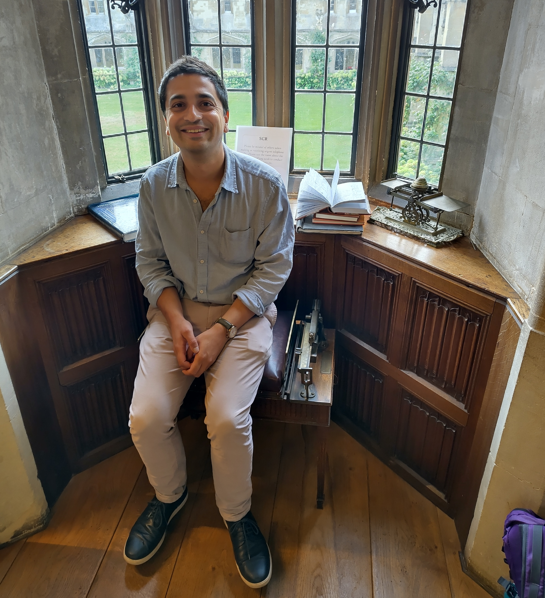
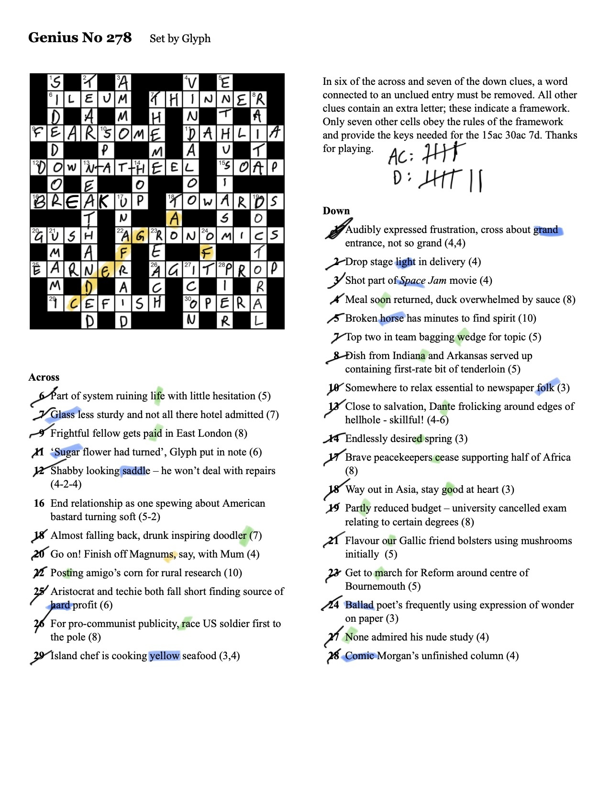

I'm a little busy at the moment trying to wrap up various things before going on holiday next week, so a shorter note.

## What I was working on

This past fortnight I interrupted my regular projects to instead focus on getting some results together for two meetings: a workshop in Oxford last week (see below) and the [Centre for Landscape Regeneration (CLR) conference](https://www.clr.conservation.cam.ac.uk/CLR-Conference-2026) coming up this Friday in Cambridge.[^1]

I won't go into too much detail about the results, as these mostly relate to projects being led by some of my CLR colleagues. I merely came in as last-minute reinforcement. However, the goal of my work here was to be able to tell stories around post-fire vegetation recovery, peatland repair, and deer management. We squeaked out some nice figures to show in our talks!

[^1]: I'm giving a talk at the CLR conference called "Change at scale: Tessera and the future of environmental monitoring". Will post slides here after the talk.

## Oxford Workshop

Alongside my colleagues [David Coomes](https://www.plantsci.cam.ac.uk/people/david-coomes) and Jessica Williams, I attended a workshop at Worcester College, Oxford last Thursday (September 10): "Measuring Landscape Health". It was jointly convened by the [Leverhulme Centre for Nature Recovery](https://naturerecovery.ox.ac.uk/) and DEFRA, with the goal of "bringing together leading academics, policy experts and practitioners to explore how landscape health can be understood and measured in ways that are scientifically meaningful and practically useful for landscape recovery".

I had a wonderful time at this workshop, and learned a great deal. In particular, I was exposed to a lot of different philosophies about "landscape health", and why it is so difficult to come to a consensus about how best to measure it.

[Rosie Hails](https://en.wikipedia.org/wiki/Rosie_Hails) from the National Trust gave a memorable final talk of the workshop, framed as "four uncomfortable truths":

1. Some species will lose for others to win.
2. Food production should not be primary object of every parcel of land.
3. We should prioritise *resilience* as the proxy for habitat condition, rather than difference from a baseline.
4. Managing nature is just as much about managing people.

More generally, throughout the workshop, there was a lot of discussion of *resilience*, which in truth is not something I've thought a great deal about yet. I had an interesting conversation with James Kempton, whose team at DEFRA have a very concrete, quantitative way of measuring ecosystem resilience: get the species inventory of an ecosystem, get trait information for all species, measure the enclosed volume within the trait space distribution, then plot a curve showing how that volume decreases as species are removed. The area under the curve is then a measure of resilience: if the hypervolume decreases far too quickly as species are removed (low area), this shows that the ecosystem is precariously dependent on a small number of species.[^2]

[^2]: James sent me [this paper](https://www.nature.com/articles/s41586-025-09788-0) which employs the methdology.

Another memorable talk was given by [Skjold Søndergaard](https://www.au.dk/en/skjold@ecos.au.dk) (Aarhus University), who implored us to introduce Asian elephants into Oxfordshire. He also suggested, as a fallback option, Bactrian camels.

## Miscellanea

### Getting weighed

In Oxford I got to stay in an excellent guest room at Magdalen College, thanks to my friend [Giles Masters](https://www.magd.ox.ac.uk/people/dr-giles-masters/), a musicologist and Junior Research Fellow at Magdalen. 

I had breakfast with Giles the next morning and he took me to Magdalen's Senior Common Room, where they have an entirely unexplained (to me) tradition of weighing guests before meals on an antique jockey scale.

{fig-align="center" fig-alt="Photograph of me sat on an antique jockey scale." width="50%"}

### Crossword Corner

[A few weeks ago](20260802_weeknotes_2026_31.qmd) I wrote about July's "Genius crossword". There was another cracking crossword in August, with another hilariously inscrutable rubric:

> In six of the across and seven of the down clues, a word connected to an unclued entry must be removed. All other clues contain an extra letter; these indicate a framework. Only seven other cells obey the rules of the framework and provide the keys needed for the 15ac 30ac 7d. Thanks for playing.

Here is the solution:

{fig-align="center" fig-alt="A filled crossword." width="70%"}

15ac 30ac 7d turned out to be SOAP OPERA THEME. Concatenating the various additional letters as instructed spelled out "FIRST ROW AND COLUMN". The first row and column spell out STAVE and F/D/B/G/E. The framework then is musical notation! The 7 other cells that "obey the rules of the framework" (i.e., cells with musical notes in the right places on the stave) are highlighted above: the Eastenders theme.