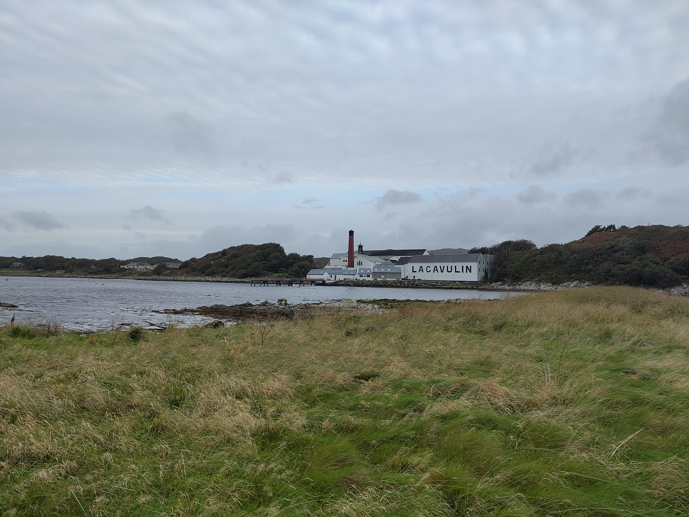

This past fortnight was one week of work and one week of holiday.

## Hinewai

I mentioned in a [previous weeknote](20260817_weeknotes_2026_33) that I've been working with PhD student [Nina de Jong](https://coomeslab.org/research-group/current-members/nina-de-jong/) on a project mapping slow successional change on the Hinewai Reserve in New Zealand. In particular, Nina is interested in how grass-dominated habitat gives way to gorse-dominated habitat, which in turn gives way to a māhoe-dominated habitat.[^1]

[^1]: This is a successional pattern seen at Hinewai, where the management practice involves leaving gorse alone and allowing it to serve as a nurse crop for NZ natives such as māhoe. This was once a controversial practice: gorse is a non-native pest!

We've developed a neat way to capture this successional change using Landsat data (i.e., capture vegetation fractions per Landsat pixel as a function of time, alongside estimates of rate of change). I've been informally calling the methodology "temporal unmixing". We're planning to do some more robust validation of the technique next week, at which point I'll share some plots. For the moment, it appears to be getting great results by eye!

## CLR Conference

The [Centre for Landscape Regeneration](https://www.clr.conservation.cam.ac.uk/), the NERC programme funding my position, had its major annual conference on September 18: [Regenerating the British Countryside, From Evidence to Action](https://www.clr.conservation.cam.ac.uk/CLR-Conference-2026). 

There were many extremely interesting talks from a range of disciplines, some discussing landscape regeneration in general, and others diving into detail with the CLR's study landscapes (the Cairngorms, Cumbria, and the Fens). One particularly memorable example (among many!) of the latter was a talk by archaeologist [Oscar Aldred](https://www.oscaraldred.co.uk/) talking about some research uncovering the prehistoric waterways, or [*roddons*](https://en.wikipedia.org/wiki/Roddon), of the Fens.

I gave a talk at the conference about [Tessera](https://geotessera.org/), and how it might be used to enable large-scale environmental monitoring. The entire conference can be relived at [this YouTube link](https://www.youtube.com/watch?v=8j0V1PZadkA), with my talk at around the 3:05:00 mark. I'll also upload my slides to this site once I get round to it.[^2]

[^2]: Fair warning: my talk had quite a high density of hijinks. 

## `sbijax`

A few weeks ago [I mentioned](20260831_weeknotes_2026_35) that I was reviewing a submission for the Journal of Open Source Software: `sbijax`.[^3] This is a Python package for performing simulation-based inference (SBI) in a JAX-based framework. 

[^3]: The open review thread can be seen [here](https://github.com/openjournals/joss-reviews/issues/11195).

With JOSS reviews, I like to properly test submitted packages with mock scientific experiments. Just before I went on holiday last week, I spent a fun morning setting up a toy problem to test `sbijax`. I wrote it up in [this GitHub gist](https://gist.github.com/aneeshnaik/09ed93e428d0d0e9bd860ac4b23143b2). Here, I'm trying to Bayesily infer $p_{\mathrm{heads}}$ of a biased coin given some "observed" coin toss outcomes.

To do this inference with simulation-based inference, one simulates the outcomes of an ensemble of coins with different biases, then feeds these "data" to a neural process which "learns" the likelihood function describing the system. Given a user-defined prior and the actual observation data, one can then infer the posterior for $p_{\mathrm{heads}}$ given the observed data.[^4]

[^4]: I chose this silly coin example because an analytic posterior exists that I can check against: provided I use a beta prior, the binomial coin-flip likelihood gives me a beta posterior. If I *really* wanted to infer the bias of a coin given some coin toss observations, training a neural process would be like bringing an aircraft carrier to a knife fight.

I found `sbijax` very pleasant to use. I'll bear it in mind if I find myself wanting to do any simulation-based inference in future.

## Islay

After the CLR conference I took a week off, and visited Islay with two old friends. Islay, an island in the Inner Hebrides, is one of the whisky regions of Scotland, famous in particular for its heavily peated whiskies. We stayed in a beautiful cottage by the sea in the south of the island, extremely near the Lagavulin distillery. View from the cottage photographed below.

{fig-align="center" fig-alt="View of the Lagavulin distillery, Islay" width="80%"}

My friends and I enjoyed a great deal of unanimity of purpose: visit some distilleries, see some birds, read some books, and solve some crosswords. On these various fronts, we enjoyed considerable success!